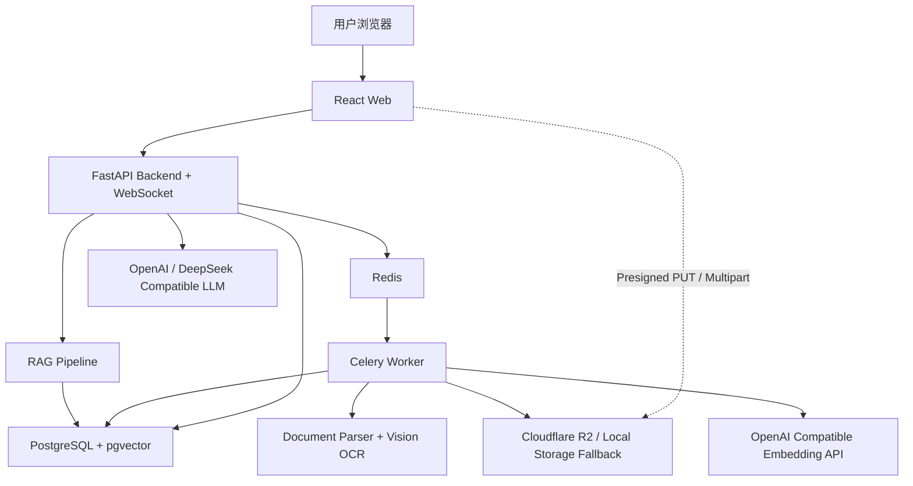
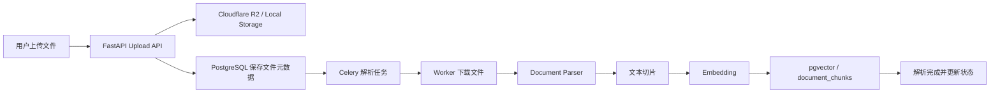
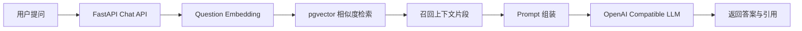
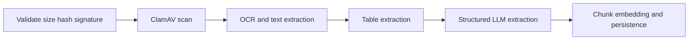

# Vision Capital AI Architecture

## 总体系统架构图

## 文件上传与解析流程图

## RAG 问答流程图

## 模块说明

- `backend/app/api`: REST API 路由层。
- `backend/app/services`: 业务服务层，聚合认证、项目、文件、聊天、报告等核心流程。
- `backend/app/repositories`: 数据访问层。
- `backend/app/storage`: R2 与本地回退存储封装。
- `backend/app/workers`: Celery 任务与 worker 入口。
- `backend/app/rag` 与 `backend/app/ai`: 文本切片、Embedding、LLM 与检索增强问答能力。
## Parsing worker stages

Each stage is a separate Celery task. The `parse_stage_runs` table stores a durable idempotency key for `batch + file + stage`, so retries do not duplicate completed work.
