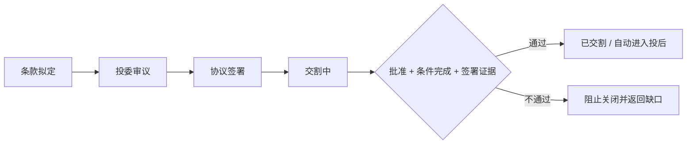

# 金融级生命周期与质量门禁

## 持续集成

`.github/workflows/ci.yml` 在每次推送到 `main` 和每个 Pull Request 上执行：

- 后端全套测试、Python 编译、依赖一致性和 Alembic 单一迁移头检查。
- 前端 TypeScript 与 Vite 生产构建。
- Docker Compose 配置检查及完整服务栈冒烟测试。
- 文档解析、OCR、公开 PDF、Excel、批量上传、WebSocket 依赖链验证。
- 固定专业投资评测集。结果保存为 `institutional-investment-evaluation` 构建产物。

专业评测门禁位于 `backend/app/evals`。v2 固定集包含 22 个投前、投中、投后案例，覆盖财务基线、
证据冲突、资料时效、来源质量、预测假设、交割条件、豁免授权、资金路径、KPI 越界、契约违约、
缺报和风险解除等 15 类场景。安全样例必须达到 80 分且不存在关键问题；无引用、虚构数字、
未知引用、忽略冲突、使用过期资料、无假设预测、缺少阶段控制或无证据解除风险等反例必须被拒绝，
且失败原因必须符合案例预期，否则 CI 失败。

## 投中交易门禁

- 非待审议状态必须记录不少于 20 个字符的投委理由。
- `closed` 只接受 `approved` 投委状态。
- 所有前置条件必须为 `satisfied` 或 `waived`；豁免原因保留在条件记录中。
- 交割至少关联一份当前项目拥有的证据文件，跨租户文件会被拒绝。

## 投后监控与风险

每个指标保存代码、名称、频率、方向、基线、目标、关注阈值、高风险阈值、负责人和数据口径。
`higher_better` 表示低于阈值变差，`lower_better` 表示高于阈值变差。高风险观测自动创建风险事件；
风险解决时间、原始观测和证据文件均保留，不覆盖历史记录。

## 持续数据与意见版本

- 只允许 HTTPS，DNS 解析结果必须是公网地址，重定向后再次校验。
- 文件大小、类型、病毒扫描、解析和租户隔离沿用资料中心控制。
- 每个意见版本记录项目阶段、建议、置信度、质量分、证据文件、来源数量和 SHA-256 证据哈希。
- 证据哈希未变化时返回现有最新版本，避免定时任务制造无意义版本。
- 规则基线只给出条件性决策状态，不替代投委授权、交易模型和人工复核。

## 当前边界

该体系提供工程和证据控制，不等同于持牌投资顾问服务。外部新闻或非官方来源即使由用户配置，也必须经过
项目相关性校验；高风险决策仍要求机构按自身授权矩阵、监管辖区和基金合同进行人工审批。
